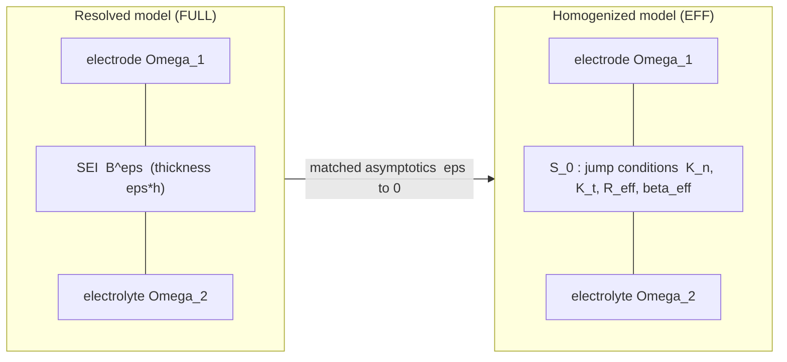
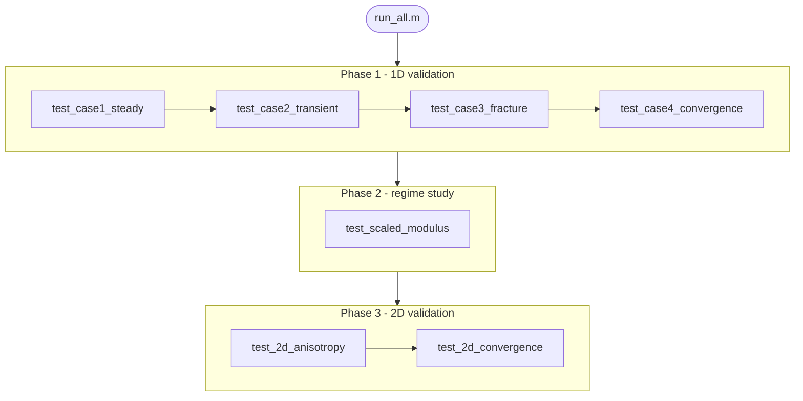

# SEI Chemo-Mechanical Homogenization

> **Reproducible code for:**
> *Asymptotic Derivation of Chemo-Mechanical Jump Conditions for the Solid
> Electrolyte Interphase in Lithium-Ion Batteries*
> M. Jaouhari · A. Rachid · A. Sbitti · R. Belemou
> *submitted 2026*

[](https://www.mathworks.com/)
[](https://www.python.org/)
[](#license)
[](#verification-and-results)

---

## Table of contents

1. [Overview](#overview)
2. [Physical model and theory](#physical-model-and-theory)
3. [Homogenization and jump conditions](#homogenization-and-jump-conditions)
4. [Numerical validation (1-D and 2-D)](#numerical-validation-1-d-and-2-d)
5. [Installation](#installation)
6. [Quick start](#quick-start)
7. [Repository structure](#repository-structure)
8. [Verification and results](#verification-and-results)
9. [Reproducing each paper result](#reproducing-each-paper-result)
10. [Provenance and reproducibility](#provenance-and-reproducibility)
11. [Citing](#citing)
12. [License](#license)

---

## Overview

This repository implements and **validates by finite elements** the asymptotic
homogenization of the nanometric Solid Electrolyte Interphase (SEI) in lithium-ion
batteries. A thin chemo-mechanical interphase (lithium diffusion coupled to
elasticity with compositional swelling) is replaced, as its thickness
$\varepsilon\to0$, by a zero-thickness **effective interface** carrying derived
jump conditions, following the matched-asymptotic framework of Marigo and
co-workers.

The entire simulation is **MATLAB** (no commercial finite-element software is used
or required); a companion **Python** pipeline regenerates the material data,
tables and figures from a single source of truth.

**Key results reproduced by this code:**

| Result | Script | Paper § |
|---|---|---|
| Effective parameters $K_n,K_t,R_{\mathrm{eff}},\beta_{\mathrm{eff}},G_c,\delta_c$ | `pipeline/recompute_effective.py` | §5, Table 3 |
| Steady trilayer — FULL vs EFF (u 0.00 %, c 1.55 %) | `tests/test_case1_steady.m` | §6.2 |
| Transient cyclic loading (0.01 %) | `tests/test_case2_transient.m` | §6.3 |
| Cohesive law — $G_c$ three independent ways (4 %) | `tests/test_case3_fracture.m` | §6.4 |
| 1-D convergence, four regimes (rates 1.67–1.91) | `tests/test_case4_convergence.m` | §6.5, Fig. 5 |
| Modulus-scaling independence of the rate | `tests/test_scaled_modulus.m` | §6.5 |
| **2-D interface anisotropy $K_n/K_t = 3.27$** | `tests/test_2d_anisotropy.m` | §7.1 |
| **2-D convergence (normal + shear), rate 0.97** | `tests/test_2d_convergence.m` | §6.5 |

---

## Physical model and theory

### Governing equations

In each phase, quasi-static elasticity is coupled to transient lithium diffusion
through a Vegard eigenstrain:

$$\nabla\!\cdot\boldsymbol\sigma=\mathbf 0,\qquad
\boldsymbol\sigma=\mathsf C:\big(\boldsymbol\varepsilon(\mathbf u)-\beta(c-c_0)\mathbf I\big),\qquad
\partial_t c=\nabla\!\cdot(D\nabla c).$$

### Scaling hypothesis

The interphase properties scale with its (dimensionless) thickness $\eta=\varepsilon/L$:

$$\mathsf C^\varepsilon=\eta^{\alpha}\widetilde{\mathsf C},\qquad
D^\varepsilon=\eta^{\gamma}\widetilde D,\qquad
\beta^\varepsilon=\eta^{\delta}\widetilde\beta.$$

### Material regimes

| Regime | $\alpha$ | Behaviour |
|---|---|---|
| soft | $>1$ | very compliant — traction-free limit |
| intermediate | $=1$ | linear spring interface |
| **critical** | $=0$ | finite stored energy — **cohesive law** |
| stiff | $<0$ | rigid — perfect-bonding limit |

Full mathematical specification: [`docs/MODEL_SPEC.md`](docs/MODEL_SPEC.md).

---

## Homogenization and jump conditions

As $\varepsilon\to0$ the interphase collapses onto the mid-surface $\mathcal S_0$,
which carries the derived effective jump conditions

$$[\![\boldsymbol\sigma\!\cdot\!\mathbf n]\!]=\mathbf 0,\qquad
\boldsymbol\sigma\!\cdot\!\mathbf n=\mathsf K_{\mathrm{eff}}\!\cdot\!\big([\![\mathbf u]\!]-\boldsymbol\beta_{\mathrm{eff}}(\langle c\rangle-c_0)\big),\qquad
[\![c]\!]=R_{\mathrm{eff}}\langle J\rangle.$$

The effective parameters are the dimensionally-correct through-thickness springs
**validated against the resolved model**:

$$K_n=\frac{\tilde\lambda+2\tilde\mu}{\varepsilon_{\mathrm{SEI}}},\quad
K_t=\frac{\tilde\mu}{\varepsilon_{\mathrm{SEI}}},\quad
R_{\mathrm{eff}}=\frac{\varepsilon_{\mathrm{SEI}}}{D_{\mathrm{SEI}}},\quad
\beta_{\mathrm{eff}}=\beta\,\varepsilon_{\mathrm{SEI}},\quad
G_c=\varepsilon_{\mathrm{SEI}}\!\sum_i f_i g_{v,i}.$$



---

## Numerical validation (1-D and 2-D)

Two resolved-vs-effective comparisons are performed, both in MATLAB.

- **1-D** (through-thickness): validates the *normal* jump conditions, the
  fracture energy $G_c$ (mode I) and the $\mathcal O(\varepsilon)$ convergence.
  This is the exact setting of the matched-asymptotic inner problem.
- **2-D** (plane strain): validates the *tensorial* result that 1-D cannot test —
  the normal/tangential **anisotropy** $K_n/K_t=2(1-\nu)/(1-2\nu)$ and mixed-mode
  behaviour. An isotropic interface is shown to fail in shear.



---

## Installation

### MATLAB (simulation)

MATLAB **R2024 or newer** (base product; no toolbox required — only sparse linear
algebra). Clone the repository; no build step.

### Python (data pipeline, optional)

```bash
cd pipeline
python -m venv .venv && .venv\Scripts\activate     # Windows
pip install -r requirements.txt                     # numpy, pandas, scipy, matplotlib
```

`mp-api` is optional (online Materials-Project queries); the pipeline runs fully
**offline** without it.

---

## Quick start

```matlab
% from the programmes/ directory, in MATLAB:
run_all          % full pipeline: 1D + scaled + 2D  (~2-3 min)
run_all('2d')    % 2D anisotropy + convergence only (~30 s)
run_all('1d')    % 1D validation only               (~45 s)
```

```bash
# headless (no GUI):
matlab -batch "run_all"
# Python pipeline:
python pipeline/recompute_effective.py
python pipeline/main.py --offline --sweep
```

Expected: every phase prints its metrics and the summary reports `PASS`.

---

## Repository structure

```
programmes/
├── README.md                     <- this file
├── run_all.m                     <- master driver (1D + scaled + 2D)
│
├── src/                          <- MATLAB source (each subfolder has a README)
│   ├── mesh/                     <- 1D/2D trilayer + effective meshes
│   ├── elements/                 <- bar, diffusion, Q4 plane-strain elements
│   ├── solvers/                  <- assembly, steady/transient, 2D solver, cohesive law
│   ├── effective/                <- config_parameters, effective_params
│   └── postproc/                 <- L2 error, field/cohesive/convergence plots
│
├── tests/                        <- validation cases (1D cases 1-4, scaled, 2D)
│   └── main_validation.m         <- 1D driver (Section 6)
│
├── pipeline/                     <- Python Materials-Project pipeline
│   ├── main.py, recompute_effective.py, example_usage.py
│   └── src/                      <- config, fetch, homogenize, compute, generators
│
├── data/                         <- constituent + effective-parameter CSVs
├── docs/                         <- MODEL_SPEC, FE_VALIDATION_REPORT, PROGRAMMES_AUDIT
├── figures/  results/  output/   <- generated artifacts
```

---

## Verification and results

| Test | What it checks | Expected | Status |
|---|---|---|---|
| `test_case1_steady` | steady FULL vs EFF | u 0.00 %, c 1.55 % | PASS |
| `test_case2_transient` | transient cyclic | 0.01 % | PASS |
| `test_case3_fracture` | $G_c$ three ways | agree 4 % | PASS |
| `test_case4_convergence` | $O(\varepsilon)$, four regimes | rates 1.67–1.91 | PASS |
| `test_scaled_modulus` | rate vs modulus scaling | identical | PASS |
| `test_2d_anisotropy` | $K_n=(\lambda{+}2\mu)/\varepsilon$, $K_t=\mu/\varepsilon$, $K_n/K_t=3.27$; isotropic fails | exact | **PASS** |
| `test_2d_convergence` | normal + shear convergence | 0.97 / 0.97 | **PASS** |

Real run logs and the full provenance are in
[`docs/FE_VALIDATION_REPORT.md`](docs/FE_VALIDATION_REPORT.md).

---

## Reproducing each paper result

### Table 3 — effective interface parameters
```bash
python pipeline/recompute_effective.py
```
Writes `data/effective_parameters_corrected.csv`; prints before/after.

### Section 6.2–6.5 — 1-D validation + Figure 5
```matlab
matlab -batch "run_all('1d')"
```
Cases 1–4; figures in `figures/`, results in `results/`.

### Section 7.1 — 2-D interface anisotropy $K_n/K_t$
```matlab
matlab -batch "addpath(genpath('src')); test_2d_anisotropy"
```
Reports $K_n,K_t$ measured from the resolved model vs theory, and the
isotropic-interface control that fails in shear.

### Section 6.5 — 2-D convergence (normal + shear)
```matlab
matlab -batch "addpath(genpath('src')); test_2d_convergence"
```

---

## Provenance and reproducibility

Every numerical claim in Section 6 of the paper maps to a script and an actual
run. The finite-element suite did **not** run as originally delivered: nine bugs
were found and fixed, and the effective parameters $K_n=C/\varepsilon$ were
**determined by simulation** (not postulated). The complete record — bugs,
fixes, the units/dimensional corrections, and the real 1-D/2-D numbers — is in:

- [`docs/FE_VALIDATION_REPORT.md`](docs/FE_VALIDATION_REPORT.md)
- [`docs/PROGRAMMES_AUDIT.md`](docs/PROGRAMMES_AUDIT.md)

No fabricated data, no commercial-FE claims: the validation is the 1-D and 2-D
MATLAB solvers in `src/`, reproducible via `run_all`.

---

## Citing

```bibtex
@article{Jaouhari2026SEI,
  author  = {Jaouhari, M. and Rachid, A. and Sbitti, A. and Belemou, R.},
  title   = {Asymptotic Derivation of Chemo-Mechanical Jump Conditions for the
             Solid Electrolyte Interphase in Lithium-Ion Batteries},
  journal = {(to be updated upon acceptance)},
  year    = {2026}
}
```

Key theoretical references:

- Abdelmoula, R., Marigo, J.-J. (2000). *The effective behavior of a fiber-bridged crack.* J. Mech. Phys. Solids.
- Pideri, C., Marigo, J.-J. (1995). *Asymptotic derivation of an imperfect interface model.* C. R. Acad. Sci.
- Bourdin, B., Francfort, G., Marigo, J.-J. (2008). *The variational approach to fracture.* J. Elasticity.

---

## License

MIT License. © 2026 the authors.
